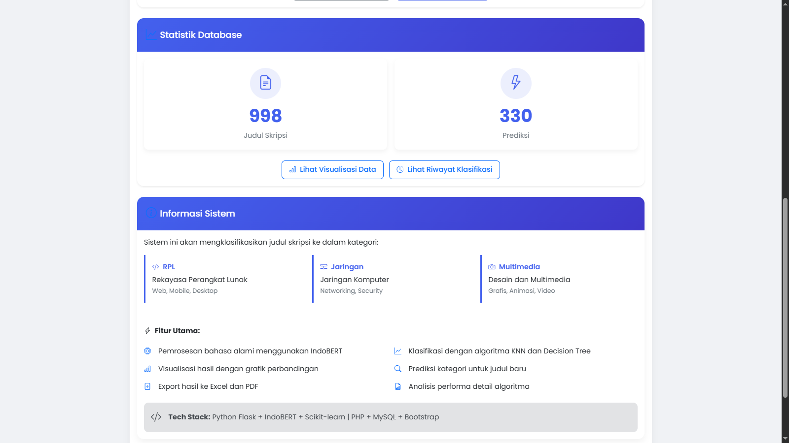

# ANALISIS PERBANDINGAN ALGORITMA K-NEAREST NEIGHBORS (KNN) DAN DECISION TREE BERDASARKAN HASIL SEMANTIC SIMILARITY JUDUL SKRIPSI DAN BIDANG KONSENTRASI

**STUDI KASUS: JURUSAN PENDIDIKAN TEKNOLOGI INFORMASI DAN KOMUNIKASI**


## Deskripsi Sistem

Sistem ini mengimplementasikan analisis perbandingan algoritma machine learning (KNN dan Decision Tree) untuk klasifikasi judul skripsi ke dalam berbagai bidang konsentrasi. Sistem ini menggunakan pendekatan semantic similarity berbasis embedding untuk memproses judul skripsi dalam bahasa Indonesia. Sistem ini dibangun dengan backend API Python untuk pemrosesan dan klasifikasi, serta frontend web PHP untuk interaksi pengguna.

## Aspek Kesesuaian Penelitian

### 1. Algoritma yang Digunakan
✅ Sistem telah mengimplementasikan kedua algoritma yang diteliti:
* K-Nearest Neighbors (KNN)
* Decision Tree dengan peningkatan Bagging Classifier

### 2. Semantic Similarity
✅ Sistem mengimplementasikan semantic similarity melalui:
* Penggunaan model IndoBERT untuk menghasilkan embedding vektor yang merepresentasikan makna semantik judul skripsi
* Perhitungan jarak/kemiripan antar embedding untuk menentukan similaritas antar judul
* Kombinasi CLS token dengan mean pooling untuk representasi teks yang lebih kaya

### 3. Bidang Konsentrasi
✅ Sistem dikembangkan untuk mengklasifikasikan judul skripsi ke dalam bidang konsentrasi yang berbeda (RPL, Jaringan, dan Multimedia) yang sesuai dengan program studi Pendidikan Teknologi Informasi dan Komunikasi.

### 4. Analisis Perbandingan
✅ Sistem melakukan analisis perbandingan antara dua algoritma melalui:
* Perhitungan dan visualisasi metrik performa (akurasi, presisi, recall, f1-score)
* Pembuatan confusion matrix untuk kedua model
* Perbandingan visual kinerja kedua algoritma
* Validasi silang untuk evaluasi yang lebih robust

### 5. Studi Kasus
✅ Sistem berfokus pada judul skripsi di bidang Teknologi Informasi dan Komunikasi, yang sesuai dengan studi kasus yang diteliti.

## Fitur Utama

- Unggah file Excel yang berisi judul-judul skripsi
- Klasifikasi otomatis judul skripsi menggunakan KNN dan Decision Tree
- Representasi visual hasil klasifikasi dan perbandingan algoritma
- Pencarian judul serupa berdasarkan input yang diberikan
- Pelacakan riwayat semua prediksi
- Ekspor hasil ke berbagai format (PDF, Excel)
- Visualisasi detail metrik performa model
- Optimasi model dengan hyperparameter tuning
- Penanganan ketidakseimbangan kelas dengan oversampling


## Struktur Proyek
```text
project/
├── python-api/
│   ├── cache/
│   ├── models/
│   ├── uploads/
│   ├── venv/
│   ├── app.py
│   └── requirements.txt
├── web/
│   ├── assets/
│   │   └── css/
│   │       └── pdf-style.css
│   ├── clasess/
│   │   └── Exporter.php
│   ├── temp/
│   ├── uploads/
│   ├── vendor/
│   ├── composer.json
│   ├── composer.lock
│   ├── config.php
│   ├── databse_config.php
│   ├── delete_history.php        
│   ├── export.php
│   ├── history.php
│   ├── index.php
│   ├── install.php
│   ├── result.php
│   ├── save_upload.php
│   ├── visualisasi.php
│   └── .gitignore
├── screenshots/
│   ├── dashboard.png
│   ├── visualisasi.png
│   ├── hasil_prediksi.png
│   ├── history.png
│   └── similarity_search.png
├── eror.txt
├── setup_environment.bat
└── start-server.bat
```
## Persyaratan Sistem

**Backend Python**
- Python 3.8 atau lebih tinggi
- Flask
- PyTorch
- Scikit-learn
- Pandas
- NumPy
- Matplotlib
- Transformers (Hugging Face)
- PyMySQL
- CORS

**Frontend PHP**
- PHP 7.4 atau lebih tinggi
- MySQL
- Composer

**Persyaratan Hardware**
- RAM minimal 8GB (direkomendasikan 16GB untuk performa optimal model IndoBERT)
- Penyimpanan: minimal 2GB ruang kosong untuk instalasi, model, dan cache
- Prosesor: Minimal dual-core, direkomendasikan quad-core untuk proses batch yang lebih cepat

## Instalasi

### Pengaturan Windows

1. Jalankan skrip pengaturan untuk membuat virtual environment dan menginstal dependensi:

    ```bash
    setup_environment.bat
    ```

2. Siapkan database MySQL:
    - Buat database baru bernama `skripsi_classification`
    - Impor skema SQL (tidak disertakan dalam repositori)

3. Konfigurasi koneksi database:
    - Edit `web/databse_config.php` dengan kredensial MySQL Anda

4. Mulai server:

    ```bash
    start-server.bat
    ```

### Pengaturan Manual

#### Backend Python

1. Buat virtual environment:

    ```bash
    cd python-api
    python -m venv venv
    source venv/bin/activate  # Di Windows: venv\Scripts\activate
    ```

2. Instal dependensi:

    ```bash
    pip install -r requirements.txt
    ```

3. Jalankan API Flask:

    ```bash
    python app.py
    ```

#### Frontend PHP

1. Instal dependensi PHP:

    ```bash
    cd web
    composer install
    ```

2. Konfigurasi web server Anda (Apache/Nginx) untuk melayani direktori web
3. Pastikan direktori uploads, temp, dan cache dapat ditulis oleh web server

## Format Data Input Optimal
### Data harus disiapkan dalam format Excel (.xlsx) dengan struktur berikut:

- Minimal 2 kolom: "Judul Skripsi" dan "Kategori" (opsional)
- Jika kolom kategori tidak disediakan, sistem akan melakukan pelabelan otomatis berdasarkan kata kunci
- Pastikan judul skripsi bersih dari karakter khusus
- Rekomendasikan minimal 30 sampel per kategori untuk performa optimal
- Contoh template dapat diunduh dari aplikasi

## Cara Kerja Sistem

### Komponen Machine Learning

Sistem ini menggunakan dua algoritma machine learning untuk klasifikasi:

- **K-Nearest Neighbors (KNN)**: Mengklasifikasikan judul skripsi berdasarkan kemiripan dengan judul lainnya
- **Decision Tree dengan Bagging**: Menggunakan ensemble method untuk mengurangi overfitting dan meningkatkan stabilitas prediksi

Kedua model menggunakan embedding IndoBERT untuk mengubah teks menjadi vektor numerik untuk pemrosesan.

## Optimasi Model

Sistem melakukan beberapa langkah optimasi untuk meningkatkan akurasi dan performa model:

1. **Feature Engineering**:
   * Penggabungan embedding dengan fitur domain khusus (panjang judul, kata kunci domain-spesifik)
   * Rasio kata unik dan pendeteksian kata metodologi

2. **Reduksi Dimensi**:
   * PCA (Principal Component Analysis) untuk mengurangi dimensi embedding
   * Feature Selection dengan SelectKBest untuk memilih fitur yang paling informatif

3. **Penanganan Ketidakseimbangan Kelas**:
   * Oversampling kelas minoritas dengan penambahan varian dengan noise kecil
   * Peningkatan jumlah sampel kategori yang kurang terwakili

4. **Hyperparameter Tuning**:
   * Optimasi parameter KNN (n_neighbors, weights)
   * Optimasi parameter Decision Tree (max_depth, criterion, min_samples_split)
   * Cross-validation untuk menemukan parameter terbaik

## Sistem Caching

Sistem mengimplementasikan caching untuk meningkatkan efisiensi:
* Embedding disimpan dalam cache untuk menghindari perhitungan ulang
* Cache disimpan ke disk secara periodik (setiap 10 entri baru)
* Sistem cache dapat menyimpan hingga ribuan embedding
* Aktivitas cache dimonitor dan dapat dilihat dalam metrik system

### Alur Data

1. Pengguna mengunggah file Excel dengan judul skripsi (dan opsional kategori)
2. Backend Python memproses file dan:
   - Menghasilkan embedding untuk setiap judul menggunakan IndoBERT
   - Melatih model KNN dan Decision Tree pada data
   - Mengevaluasi performa model
   - Mengembalikan visualisasi dan metrik performa
3. Hasil ditampilkan pada antarmuka web
4. Prediksi disimpan dalam database untuk referensi di masa mendatang


## Endpoint API

* `/process` - Memproses file Excel dan melatih model
* `/predict` - Memprediksi kategori judul skripsi baru
* `/similar` - Mencari judul skripsi yang serupa
* `/template` - Mengunduh template Excel
* `/delete_prediction/<id>` - Menghapus prediksi
* `/get_predictions` - Mendapatkan semua prediksi
* `/get_prediction/<id>` - Mendapatkan detail prediksi tertentu
* `/get_predictions_by_upload/<id>` - Mendapatkan prediksi dari unggahan tertentu
* `/get_uploaded_files` - Mendapatkan daftar semua file yang diunggah
* `/model_status` - Mendapatkan status model dan akurasi terkini
* `/tune_model` - Melakukan tuning manual terhadap parameter model


## Penggunaan

1. Buka antarmuka web di browser Anda
2. Unggah file Excel dengan judul skripsi atau gunakan template yang disediakan
3. Lihat hasil klasifikasi dan metrik performa perbandingan algoritma
4. Prediksi kategori untuk judul skripsi baru
5. Cari judul yang serupa
6. Ekspor hasil ke PDF atau Excel
7. Lihat riwayat semua prediksi

## Detail Teknis

### Model IndoBERT
Sistem ini menggunakan model `indobenchmark/indobert-base-p1` untuk menghasilkan embedding. Model ini secara khusus dilatih pada teks bahasa Indonesia, membuatnya sangat cocok untuk memproses judul skripsi dalam bahasa Indonesia.

Teknik embedding yang digunakan adalah kombinasi dari:
* CLS token embedding (representasi seluruh kalimat)
* Mean pooling dari semua token (rata-rata semua token setelah attention masking)

Ini memberikan representasi yang lebih kaya dibandingkan dengan hanya menggunakan CLS token.

### Penanganan Bahasa
Sistem dioptimalkan untuk Bahasa Indonesia, dengan fitur-fitur khusus:
* Preprocessing teks dengan menghapus stopwords bahasa Indonesia
* Normalisasi teks untuk mengatasi variasi penulisan
* Tidak ada deteksi bahasa otomatis - semua input diasumsikan dalam Bahasa Indonesia
* Untuk judul dalam bahasa lain, hasil mungkin kurang optimal

### Bagging Classifier
Untuk meningkatkan performa Decision Tree, sistem menggunakan Bagging Classifier yang:
* Melatih beberapa pohon keputusan pada subset data yang berbeda
* Menggabungkan hasil dari semua "pohon" untuk prediksi final
* Mengurangi overfitting dan meningkatkan stabilitas model
* Default menggunakan 10 estimator, dapat diubah melalui parameter

### Struktur Database

Tabel utama dalam database meliputi:
- `thesis_titles` - Menyimpan judul skripsi dan kategorinya
- `categories` - Menyimpan informasi kategori
- `predictions` - Menyimpan hasil prediksi
- `model_performances` - Menyimpan metrik performa model
- `keyword_analysis` - Menyimpan hasil analisis kata kunci
- `uploaded_files` - Menyimpan informasi tentang file yang diunggah
- `model_visualizations` - Menyimpan gambar visualisasi performa model dalam format base64
- `search_history` - Menyimpan riwayat pencarian kemiripan

## Pemecahan Masalah

### Masalah Umum

1. **Error Loading IndoBERT model**:
  * Pastikan Anda memiliki koneksi internet saat pertama kali menjalankan aplikasi
  * Cek apakah ada cukup ruang disk untuk menyimpan model (sekitar 500MB)
  * Pastikan Anda memiliki versi PyTorch yang kompatibel

2. **Memory Error saat Memproses File Besar**:
  * Kurangi ukuran batch untuk proses embedding (`batch_size` dalam kode)
  * Proses file dengan jumlah baris yang lebih sedikit
  * Tingkatkan RAM yang tersedia atau gunakan sistem dengan memori lebih besar

3. **Akurasi Rendah**:
  * Pastikan data training memiliki distribusi yang seimbang antar kategori
  * Tambahkan lebih banyak contoh untuk setiap kategori (minimal 30-50 judul per kategori)
  * Coba melakukan tuning manual parameter melalui endpoint `/tune_model`

4. **Koneksi Database Gagal**:
  * Verifikasi kredensial database di `databse_config.php`
  * Pastikan server MySQL berjalan
  * Cek apakah database `skripsi_classification` sudah dibuat

### Pengecekan Log

* Periksa file `eror.txt` untuk log kesalahan
* Cek output konsol dari server Python untuk detail error
* Periksa log PHP melalui log server web Anda

## Rencana Pengembangan

Untuk pengembangan masa depan, beberapa fitur dan peningkatan yang direncanakan:

1. **Multilingualisme**:
  * Dukungan untuk judul dalam bahasa Inggris dan bahasa lainnya
  * Deteksi bahasa otomatis dan pemilihan model embedding yang sesuai

2. **Peningkatan Model**:
  * Implementasi algoritma tambahan (SVM, Random Forest, Neural Networks)
  * Fine-tuning model IndoBERT khusus untuk domain akademik

3. **Fitur UI/UX**:
  * Dashboard analitik yang lebih interaktif
  * Visualisasi model dan representasi embedding menggunakan tSNE atau UMAP
  * Mode perbandingan multi-model yang lebih komprehensif

4. **Optimasi Kinerja**:
  * Kompresi model untuk mengurangi kebutuhan memori
  * Implementasi caching yang lebih efisien
  * Dukungan untuk GPU acceleration

## Lisensi

Proyek ini dilisensikan di bawah lisensi MIT - lihat file LICENSE untuk detail.

Komponen pihak ketiga yang digunakan:
* IndoBERT oleh IndoNLP - Apache License 2.0
* Flask - BSD License
* Scikit-learn - BSD License
* PyTorch - BSD License
* Hugging Face Transformers - Apache License 2.0

## Kredit

Proyek ini menggunakan komponen utama berikut:
* IndoBERT oleh IndoNLP
* Flask untuk server API
* Scikit-learn untuk algoritma machine learning
* Hugging Face Transformers untuk pemrosesan NLP
* Matplotlib untuk visualisasi
* PyTorch untuk deep learning framework


## Dokumentasi Lainnya


